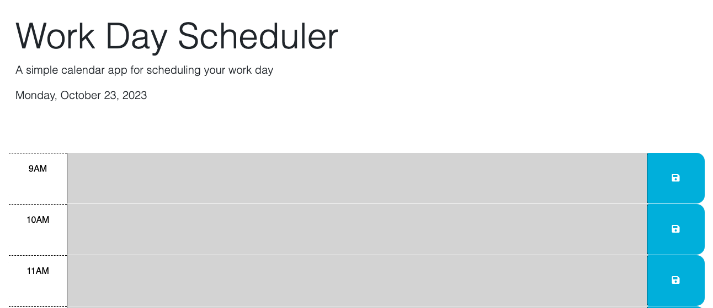

# Work Day Scheduler

## Description

The purpose of this work day scheduler is to help busy coding students keep track of their schedule. The webpage consists of a heading with the webpage title and the current date, and a series of text boxes for the normal work hours of 9:00 am-5:00 pm. The time blocks are color coded to indicate whether each time block is in the past (grey), in the future (green), or the current time (red). Additionally, at the end of each time block there is a save button to let the user store their appointments in local storage.

## Installation

N/A

## Usage

To use this work day scheduler, enter any appointments in the text area of the time block that corresponds to the time of the appointment. When you click the save button, the appointment will be added to local storage and a confirmation message will appear below the current date. When you refresh the page, any appointments you have saved will render in their corresponding time block.

## Credits

N/A

## Link

https://elisestankus.github.io/work-day-scheduler/

## Screenshot

